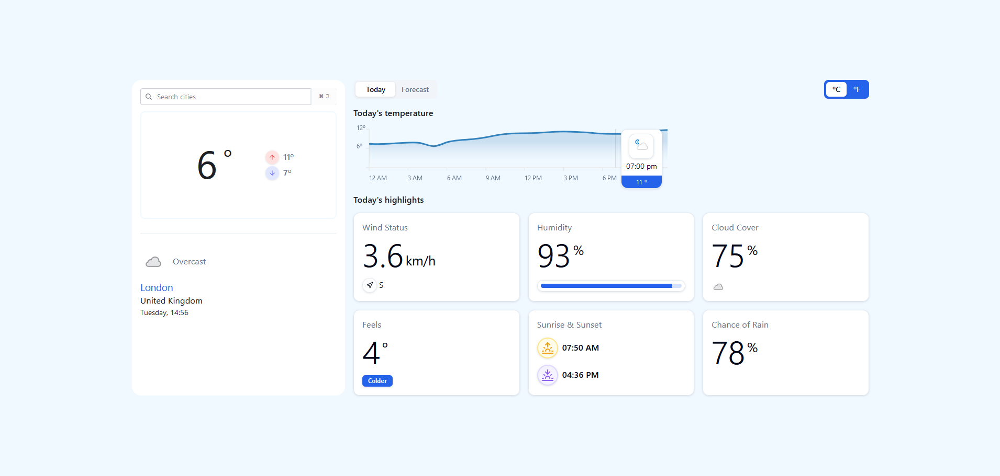

# Weather App Challenge

live demo: https://weather-app-challenge-jk.netlify.app

## Description

This is a simple weather app that uses the WeatherAPI to display the current weather in a given city.

This app took me approximately 4-5 days to complete.



## Features

- Search for a city
- Display the current weather in that city
- Display forecast (7 days) in that city
- Display the weather for the next 24 hours in that city
- Display weather information like humidity, wind speed, and more
- Switch between Fahrenheit and Celsius
- Cypress e2e tests
- Error handling

## Tech Stack

- React
- Zustand
- Local Storage
- Tailwind
- Shadcn/ui
- Radix ui
- date-fns
- React Router Dom
- Yup
- Recharts
- Cypress
- Docker

## Considerations

- I used Zustand for state management because it's a simple and lightweight state management library that I've used before and I'm familiar with.
- I used Local Storage to persist the state in the browser so that the user can get the preferred configuration (Celsius or Fahrenheit) and the history when they return to the app.
- I used Tailwind/Shacnui/Radixui for styling due to speed + accessibility.
- I used React Router Dom for routing because it's a two page only app with small number of API calls. So I used a routing fetch strategy to fetch the data when the user navigates to the page. With more complex apps I would use a data fetching library like React Query.

## Installation

1. Clone the repo
   ```sh
   git clone [repo url]
   ```
2. Install NPM packages
   ```sh
   npm install
   ```
3. Start the app
   ```sh
   npm start
   ```
4. Run the tests
   ```sh
   npx cypress open
   ```
