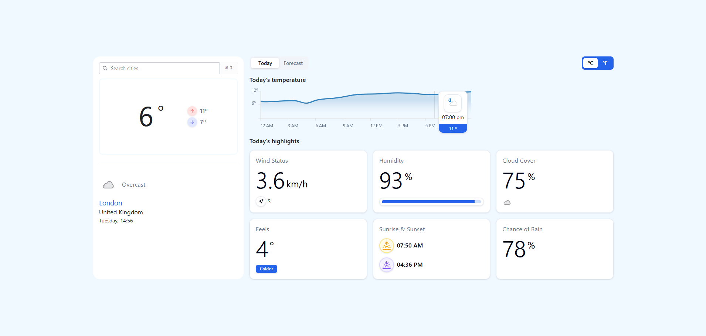

# Weather App Challenge

## Description

This is a simple weather app that uses the WeatherAPI to display the current weather in a given city.

This app took me approximately 4-5 days to complete.



## Features

- Search for a city
- Display the current weather in that city
- Display forecast (7 days) in that city
- Display the weather for the next 24 hours in that city
- Display weather information like humidity, wind speed, and more
- Switch between Fahrenheit and Celsius
- Cypress e2e tests
- Error handling

## Tech Stack

- React
- Zustand
- Tailwind
- Shadcn/ui
- Radix ui
- date-fns
- React Router Dom
- Yup
- Recharts
- Cypress
- Docker

## Installation

1. Clone the repo
   ```sh
   git clone [repo url]
   ```
2. Install NPM packages
   ```sh
   npm install
   ```
3. Start the app
   ```sh
   npm start
   ```
4. Run the tests
   ```sh
   npx cypress open
   ```
